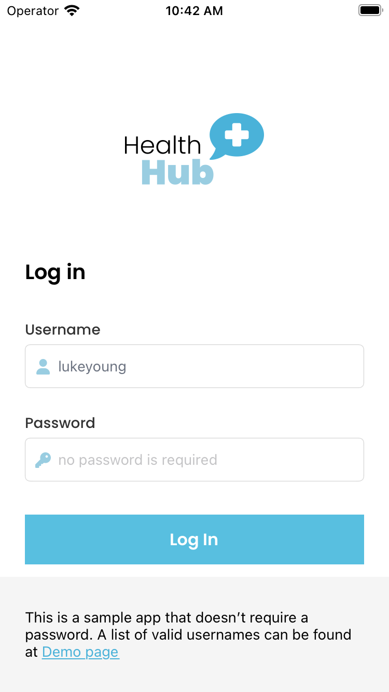

# Telehealth Application

`telehealth-example` is a basic chat application that features communication between doctor and patient.

 

## Prerequisites

This application uses [PubNub Swift SDK](https://github.com/pubnub/swift) for chat components and [UIKit](https://developer.apple.com/documentation/uikit) as the UI Toolkit.

To use the app, you need:

* [Xcode](https://developer.apple.com/xcode/) (>= Xcode 13)
* PubNub account on [Admin Portal](https://dashboard.pubnub.com/).

## Usage

Read the [Getting Started](https://www.pubnub.com/docs/chat/components/ios/get-started-ios) guide to learn how to use the app and better understand the logic behind it.

## Features

The `telehealth-example` app showcases these PubNub Chat Components for iOS:

* [MessageInput](https://www.pubnub.com/docs/chat/components/ios/ui-components-ios#messageinput)
* [MessageList](https://www.pubnub.com/docs/chat/components/ios/ui-components-ios#messagelist)
